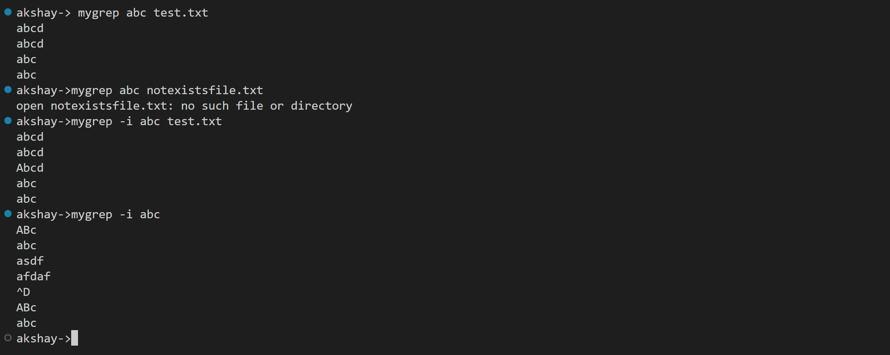

# mygrep

## Run Locally
install go (https://go.dev/doc/install)

clone repository
```sh
git clone https://github.com/akshaym-3255/mygrep.git
```

run 
```sh
go install
```
this will build go project and add compiled binary to GOPATH
make sure path of GOPATH exits in PATH variable

## Usage
search pattern in a file
```sh
mygrep <pattern> <filename>
```
 
 to serach a pattern from directory 
```sh
mygrep -r <pattern> <directory-name>
```

to search pattern from stdIn
```sh
mygrep <pattern>
```

to write outPut to file
```sh 
mygrep <pattern> -o=<filename>
```


## output



#Flags:
 ```
  -h, --help                help for mygrep
  -i, --insensitive         insensitive match
  -o, --outputFile string   write output to file
  -r, --recursive           recursive search
```